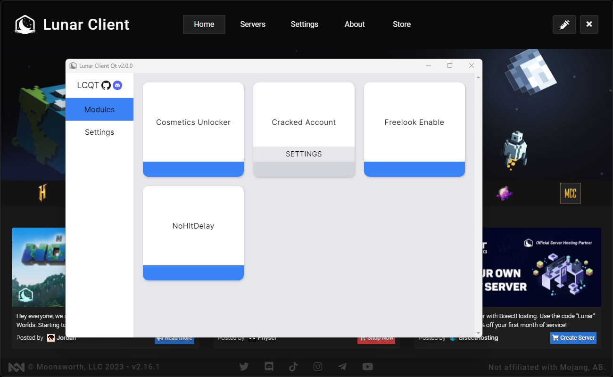

<h1 align="center">
    Lunar Client Qt 2
    <a href="https://discord.gg/mjvm8PzB2u">
        
    </a>
</h1>
<p align="center">
    <strong>Continuation of the original <a href="https://github.com/nilsen84/lunar-client-qt">lunar-client-qt</a> </br> Moved to a new repo because of the complete rewrite and redesign.</strong>
</p>
<p align="center">
    </br>
</p>

  ## FAQ
  **Q: Can I be banned for using this?** </br>
  A: Lets break this into 2 types of bans: </br>
  - Lunar: While LCQT is *theoretically* detectable on lunars end, as of right now they do not issue client bans. </br>
  - Hypixel / Other Servers: LCQT does not send any information to the server. As long as you don't abuse any disabled mods (e.g chat macros) you will not be banned. 
  
  **Q: Why isn't cosmetics working on a cracked account?** </br>
  A: Because of the way the cosmetics unlocker is implemented you have to be connected to lunars servers for it to work. </br>
  For obvious reasons lunars websocket server does not allow cracked accounts. </br>
  ***Note: Premium users on cracked servers, this is applicable to you as well.***

  **Q: Why isn't my JRE working under Custom JVM?** </br>
  A: Your JRE/JDK needs to be Java 17. </br>

  **Q: How do I add a java agent?** </br>
  A: Append the following to your JVM Arguments in **Settings**: `-javaagent:/path/to/.jar` </br>
  You must use forward slashes (/) or double backslashes (\\) in your path.
  
***Note: As always, use this at YOUR OWN RISK, I am not responsible for any damages that may occur.***

  ## Installation
  #### Windows
  Simply download and run the setup executable [here](https://github.com/Nilsen84/lcqt2/releases/latest). </br>
  If you prefer a portable version, download the [zip](https://github.com/Nilsen84/lcqt2/releases/latest/download/windows-portable.zip).
  #### macOS/Linux
  > If you are using Linux, be sure to have the `Lunar Client-X.AppImage` renamed to `lunarclient` in `/usr/bin/`.
  1. Download the file: [Linux](https://github.com/Nilsen84/lcqt2/releases/latest/download/linux-portable.tar.gz) or [macOS](https://github.com/Nilsen84/lcqt2/releases/latest/download/macos-portable.tar.gz).
  2. Extract it anywhere (`tar -xf os-portable.tar.gz`)
  3. Run the `Lunar Client Qt` executable

  > **IMPORTANT:** All 3 files which where inside the tar need to stay together.  
  > You are allowed to move all 3 together, you're also allowed to create symlinks.

  ## Building
  #### Prerequisites
  - Rust Nightly
  - NPM

  #### Building
  LCQT2 is made up of 3 major components:
  - The injector - responsible for locating the launcher executable and injecting a javascript patch into it
  - The gui - contains the gui opened by pressing the syringe button, also contains the javascript patch used by the injector
  - The agent - java agent which implements all game patches

  In order for lcqt to work properly all 3 components need to be built into the same directory.

  ```bash
  $ ./gradlew installDist # builds all 3 components and generates a bundle in build/install/lcqt2
  ```
  ```bash
  $ ./gradlew run # equivalent to ./gradlew installDist && './build/install/lcqt2/Lunar Client Qt'
  ```
  > `./gradlew installDebugDist` and `./gradlew runDebug` do the same thing except they build the rust injector in debug mode.

###### Copyright © 2023 Nilsen84 - [License](https://raw.githubusercontent.com/Nilsen84/lcqt2/master/LICENSE)
